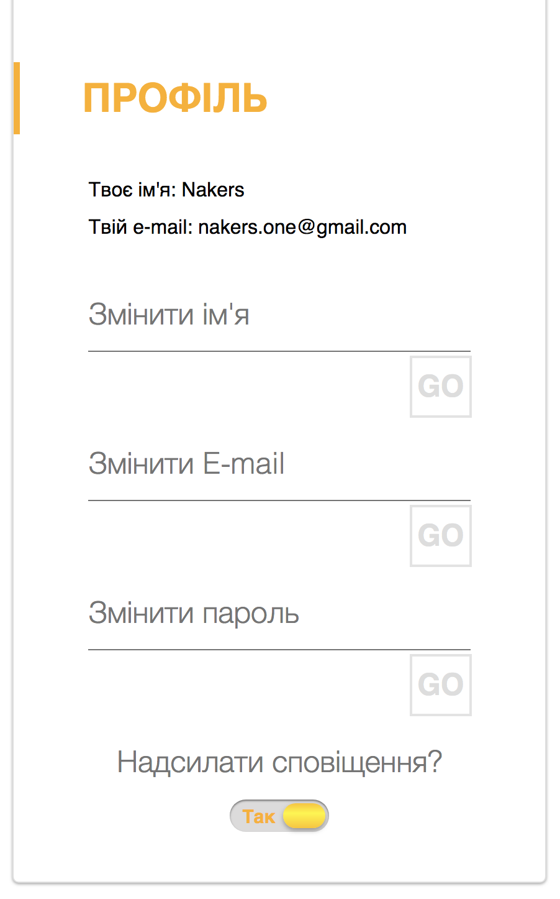
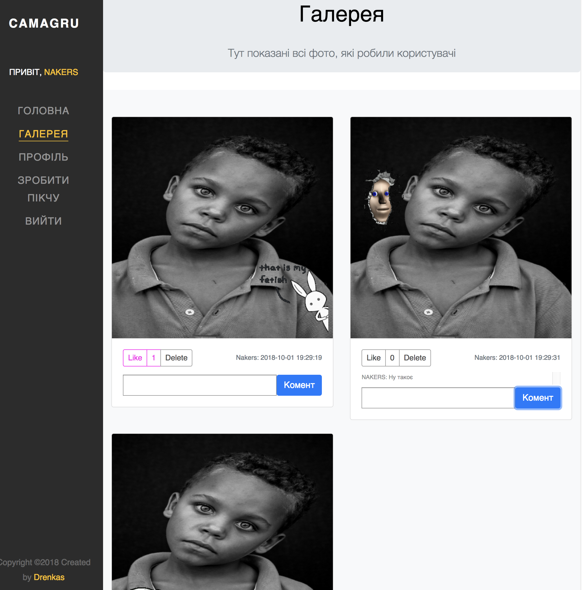

# CAMAGRU

### Installation

First, you need to install an apache server (WAMP \ MAMP \ XAMPP or other).
Place the project in the root folder (htdocs for MAMP).

In file ./application/config/db.php change password and user for database.

And go to localhost:your_port/project_pathname

### Using

You are on the home page.

Desktop version:

Mobile version:

You can create an account and log in. To do this, you need to fill out forms and go to validate your email. All fields are validated and notified of errors.

Register component:

Confirm email:

After authorization, a session and a record will be created in the database with user data.

At any time you can change the profile data.

#### Snapshot

The main functionality is to create a photo with a sticker. You can move the sticker around the preview area and change them. Also, if you do not have a webcam, you can upload photos from a PC. You can add a comment to the photo and see up to 3 of your latest shots. 

Before you post your picture, look how it looks with the commentary.

`A picture without a sticker is IMPOSSIBLE`.

#### Gallery

All published pictures can be seen in the Gallery. All the pictures of all users are displayed there. Pictures can be viewed by all users, including guests. But only authorized users can comment and like. You can also delete your entries.
The gallery shows up to 6 pictures on one page.

After logout:

All data is stored in a MySQL database

**Thank you for watching! Hell Yeah!**